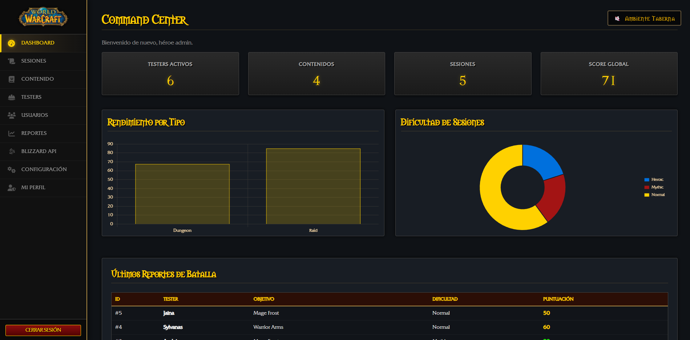

# 📚 WoW Test Manager - Documentación Técnica Completa

## 🎮 Resumen del Proyecto

**WoW Test Manager** es un sistema completo de gestión de pruebas QA (Quality Assurance) con temática de World of Warcraft, desarrollado completamente en **PHP puro** con base de datos **SQLite**. El proyecto implementa un panel de administración robusto y seguro para gestionar testers, sesiones de prueba, contenido y reportes.

### Tecnologías Utilizadas

- **Backend**: PHP 8.2.12 con PDO (PHP Data Objects)
- **Base de Datos**: SQLite 3 con sentencias preparadas
- **Frontend**: HTML5, CSS3 vanilla, JavaScript nativo
- **Visualización**: Chart.js para gráficos estadísticos
- **Exportación**: TCPDF para generación de PDFs profesionales
- **API Externa**: Blizzard Battle.net API con cURL
- **Servidor**: Apache 2.4.58 (XAMPP)

---

## 🖼️ Capturas de Pantalla del Sistema

### Página de Login


Interfaz de autenticación con diseño temático de WoW, incluyendo las estatuas del Portal Oscuro y validación CSRF.

### Dashboard (Command Center)



Panel principal con KPIs en tiempo real, gráficos interactivos de rendimiento y tabla de sesiones recientes.

### Gestión de Testers


Formulario de registro de testers con roles (Tank/DPS/Healer) y facciones, junto con tabla de gestión completa.

### Gestión de Sesiones


Registro detallado de sesiones de prueba con puntuaciones, dificultad, tiempo jugado y comentarios.

### Gestión de Contenido


Administración de contenido a probar (Raids, Dungeons, Classes, Talents) con información de parches.

### Gestión de Usuarios


Panel de administración de usuarios del sistema con roles jerárquicos (admin, tester, viewer).

### Página de Reportes


Estadísticas detalladas con top testers, contenido difícil y exportación a CSV/PDF profesional.

### Sincronización Blizzard API


Interfaz para vincular testers con personajes reales de WoW y sincronizar datos desde la API oficial.

### Configuración del Sistema


Panel de configuración con opciones de personalización del tema, colores y preferencias del sistema.

### Perfil de Usuario


Página de perfil personal con información del usuario, estadísticas y opciones de cuenta.

---

## 🎯 Funcionalidades Principales

### 1. Sistema de Autenticación y Autorización

#### Características
- **Login seguro** con protección CSRF
- **Sistema de roles jerárquico**: viewer < tester < admin
- **Protección anti-fuerza bruta**: 5 intentos, bloqueo de 15 minutos
- **Sesiones blindadas** con cookies HttpOnly

#### Código de Ejemplo

```php
// includes/wow_auth.php

function verificarLogin() {
    if (!isset($_SESSION['user'])) {
        header("Location: ../auth/wow_login.php");
        exit;
    }
}

function verificarRol($rolRequerido) {
    $roles = ['viewer' => 1, 'tester' => 2, 'admin' => 3];
    $miRol = $_SESSION['user']['role'] ?? 'viewer';
    
    if (($roles[$miRol] ?? 0) < ($roles[$rolRequerido] ?? 0)) {
        die("<h1>Acceso Denegado</h1>");
    }
}

function validarCSRF($token) {
    if (empty($token) || $token !== ($_SESSION['csrf_token'] ?? '')) {
        die("Error de seguridad (CSRF).");
    }
}
```

---

### 2. Dashboard Interactivo

#### Características
- **KPIs en tiempo real**: Testers activos, contenidos, sesiones, score global
- **Gráficos dinámicos** con Chart.js:
  - Rendimiento por tipo de contenido (Raid, Dungeon, Class, Talent)
  - Distribución de dificultad (Normal, Heroic, Mythic)
- **Tabla de sesiones recientes** con código de colores por puntuación
- **Música ambiente** de taberna (opcional)

#### Código de Ejemplo

```php
// admin/wow_dashboard.php

// Obtener estadísticas
$totalTesters = (int)$db->query("SELECT COUNT(*) FROM tester")->fetchColumn();
$totalContenido = (int)$db->query("SELECT COUNT(*) FROM content")->fetchColumn();
$totalSesiones = (int)$db->query("SELECT COUNT(*) FROM test_session")->fetchColumn();
$promedioScore = $db->query("SELECT AVG(score) FROM test_session")->fetchColumn();

// Últimas sesiones
$sesiones = $db->query("
    SELECT s.id, tester.name AS tester, content.name AS contenido,
           s.difficulty, s.score
    FROM test_session s
    JOIN tester ON s.tester = tester.id
    JOIN content ON s.content = content.id
    ORDER BY s.id DESC LIMIT 5
")->fetchAll(PDO::FETCH_ASSOC);
```

---

### 3. Gestión de Testers

#### Características
- **CRUD completo** (Crear, Leer, Actualizar, Eliminar)
- **Roles**: Tank, DPS, Healer
- **Facciones**: Alliance, Horde, Neutral
- **Vinculación con personajes WoW** (Fase 2)
- **Paginación** de resultados

#### Código de Ejemplo

```php
// admin/wow_testers.php

if ($_SERVER['REQUEST_METHOD'] === 'POST') {
    validarCSRF($_POST['csrf_token'] ?? '');
    
    if (isset($_POST['delete'])) {
        $stmt = $db->prepare("DELETE FROM tester WHERE id = ?");
        $stmt->execute([(int)$_POST['delete']]);
    } else {
        $id = (int)$_POST['id'];
        $name = trim($_POST['name']);
        $role = $_POST['role'];
        $faction = $_POST['faction'];
        
        if ($id > 0) {
            // Actualizar
            $stmt = $db->prepare("UPDATE tester SET name=?, role=?, faction=? WHERE id=?");
            $stmt->execute([$name, $role, $faction, $id]);
        } else {
            // Crear
            $stmt = $db->prepare("INSERT INTO tester (name, role, faction) VALUES (?, ?, ?)");
            $stmt->execute([$name, $role, $faction]);
        }
    }
}
```

---

### 4. Gestión de Sesiones de Prueba

#### Características
- **Registro detallado** de sesiones QA
- **Campos**: Tester, Contenido, Dificultad, Score (0-100), Tiempo, Comentarios
- **Búsqueda y filtrado** de sesiones
- **Validación de datos** con funciones nativas PHP
- **Paginación** de resultados

#### Código de Ejemplo

```php
// admin/wow_sesiones.php

if ($_SERVER['REQUEST_METHOD'] === 'POST' && !isset($_POST['delete'])) {
    validarCSRF($_POST['csrf_token'] ?? '');
    
    $tester = (int)$_POST['tester'];
    $content = (int)$_POST['content'];
    $difficulty = $_POST['difficulty'];
    $score = (int)$_POST['score'];
    $hours = (int)($_POST['hours'] ?? 0);
    $minutes = (int)($_POST['minutes'] ?? 0);
    $comments = trim($_POST['comments']);
    
    $timePlayed = sprintf("%dh%02dm", $hours, $minutes);
    
    if ($id > 0) {
        // Actualizar
        $stmt = $db->prepare("
            UPDATE test_session 
            SET tester=?, content=?, difficulty=?, score=?, time_played=?, comments=? 
            WHERE id=?
        ");
        $stmt->execute([$tester, $content, $difficulty, $score, $timePlayed, $comments, $id]);
    } else {
        // Crear
        $stmt = $db->prepare("
            INSERT INTO test_session (tester, content, difficulty, score, time_played, comments) 
            VALUES (?, ?, ?, ?, ?, ?)
        ");
        $stmt->execute([$tester, $content, $difficulty, $score, $timePlayed, $comments]);
    }
}
```

---

### 5. Sistema de Reportes y Exportación

#### Características
- **Estadísticas avanzadas**:
  - Top 5 testers por calidad
  - Contenido más difícil
  - Distribución de sesiones
- **Exportación CSV** completa
- **Exportación PDF profesional** con TCPDF (Fase 2)

#### Código de Ejemplo - Exportación CSV

```php
// admin/wow_reportes.php

if (isset($_GET['export'])) {
    header('Content-Type: text/csv; charset=utf-8');
    header('Content-Disposition: attachment; filename=reporte_wow.csv');
    
    $output = fopen('php://output', 'w');
    fputcsv($output, ['ID', 'Tester', 'Contenido', 'Dificultad', 'Score', 'Horas', 'Comentarios']);
    
    $rows = $db->query("
        SELECT s.id, t.name AS tester, c.name AS contenido, 
               s.difficulty, s.score, s.time_played, s.comments
        FROM test_session s
        JOIN tester t ON s.tester = t.id
        JOIN content c ON s.content = c.id
        ORDER BY s.id DESC
    ")->fetchAll(PDO::FETCH_ASSOC);
    
    foreach ($rows as $row) {
        fputcsv($output, $row);
    }
    
    fclose($output);
    exit;
}
```

#### Código de Ejemplo - Exportación PDF

```php
// admin/wow_reportes_pdf.php

require_once __DIR__ . '/../vendor/autoload.php';

class WoWReportPDF extends TCPDF {
    public function Header() {
        $logoPath = __DIR__ . '/../assets/wow_logo.png';
        if (file_exists($logoPath)) {
            $this->Image($logoPath, 15, 10, 30);
        }
        
        $this->SetFont('helvetica', 'B', 18);
        $this->SetTextColor(255, 209, 0); // Dorado WoW
        $this->Cell(0, 15, 'WoW Test Manager', 0, false, 'C');
    }
}

$pdf = new WoWReportPDF(PDF_PAGE_ORIENTATION, PDF_UNIT, PDF_PAGE_FORMAT, true, 'UTF-8', false);
$pdf->SetCreator('WoW Test Manager');
$pdf->SetTitle('Reporte de Sesiones QA - ' . date('d/m/Y'));
$pdf->AddPage();

// Añadir contenido al PDF...
$pdf->Output('reporte_wow_' . date('Ymd') . '.pdf', 'D');
```

---

### 6. Integración con Blizzard API (Fase 2)

#### Características
- **Autenticación OAuth2** con credenciales de cliente
- **Consulta de perfiles** de personajes WoW
- **Datos sincronizados**:
  - Nivel del personaje
  - Clase (con nombre localizado)
  - Item Level (ilvl)
  - Facción
- **Sistema de caché** (TTL configurable)
- **Manejo robusto de errores** HTTP

#### Código de Ejemplo - Autenticación

```php
// includes/blizzard_api.php

class BlizzardAPI {
    private $clientId;
    private $clientSecret;
    private $accessToken = null;
    
    public function authenticate() {
        if ($this->accessToken && time() < $this->tokenExpiry) {
            return true;
        }
        
        $ch = curl_init(BLIZZARD_OAUTH_URL);
        curl_setopt_array($ch, [
            CURLOPT_RETURNTRANSFER => true,
            CURLOPT_POST => true,
            CURLOPT_USERPWD => $this->clientId . ':' . $this->clientSecret,
            CURLOPT_POSTFIELDS => 'grant_type=client_credentials',
            CURLOPT_TIMEOUT => 10
        ]);
        
        $response = curl_exec($ch);
        $httpCode = curl_getinfo($ch, CURLINFO_HTTP_CODE);
        curl_close($ch);
        
        if ($httpCode === 200 && $response) {
            $data = json_decode($response, true);
            $this->accessToken = $data['access_token'];
            $this->tokenExpiry = time() + ($data['expires_in'] ?? 86400) - 300;
            return true;
        }
        
        return false;
    }
}
```

#### Código de Ejemplo - Consulta de Perfil

```php
public function getCharacterProfile($realm, $name) {
    if (!$this->authenticate()) {
        return null;
    }
    
    // Verificar caché
    $cacheKey = "profile_{$realm}_{$name}";
    $cached = $this->getCachedData($cacheKey, 3600);
    if ($cached !== null) {
        return $cached;
    }
    
    $realm = strtolower(str_replace(' ', '-', $realm));
    $name = strtolower($name);
    
    $url = BLIZZARD_API_URL . "/profile/wow/character/{$realm}/{$name}";
    $url .= "?namespace=profile-" . BLIZZARD_REGION . "&locale=" . BLIZZARD_LOCALE;
    
    $ch = curl_init($url);
    curl_setopt_array($ch, [
        CURLOPT_RETURNTRANSFER => true,
        CURLOPT_HTTPHEADER => ['Authorization: Bearer ' . $this->accessToken],
        CURLOPT_TIMEOUT => 10
    ]);
    
    $response = curl_exec($ch);
    $httpCode = curl_getinfo($ch, CURLINFO_HTTP_CODE);
    curl_close($ch);
    
    if ($httpCode === 200) {
        $data = json_decode($response, true);
        $this->setCachedData($cacheKey, $data);
        return $data;
    }
    
    return null;
}
```

---

### 7. Sistema de Seguridad Mejorado (Fase 2)

#### Características
- **Validaciones nativas PHP** con `filter_var()`
- **Logs de auditoría** automáticos
- **Protección CSRF** en todas las operaciones POST
- **Sanitización XSS** con `htmlspecialchars()`
- **Control de permisos** granular por módulo

#### Código de Ejemplo - Validaciones Nativas

```php
// includes/wow_auth.php

function validarEmail($email) {
    $emailLimpio = filter_var($email, FILTER_SANITIZE_EMAIL);
    return filter_var($emailLimpio, FILTER_VALIDATE_EMAIL) !== false;
}

function validarEntero($valor, $min = null, $max = null) {
    $opciones = ['options' => []];
    if ($min !== null) $opciones['options']['min_range'] = $min;
    if ($max !== null) $opciones['options']['max_range'] = $max;
    
    return filter_var($valor, FILTER_VALIDATE_INT, $opciones) !== false;
}

function sanitizarTexto($texto) {
    $limpio = trim($texto);
    return htmlspecialchars($limpio, ENT_QUOTES, 'UTF-8');
}

function validarURL($url) {
    return filter_var($url, FILTER_VALIDATE_URL) !== false;
}
```

#### Código de Ejemplo - Sistema de Auditoría

```php
function registrarAccionAuditoria($usuarioId, $modulo, $accion, $detalles = '') {
    try {
        $dbPath = __DIR__ . "/../database/wow.sqlite";
        $db = new PDO("sqlite:" . $dbPath);
        $db->setAttribute(PDO::ATTR_ERRMODE, PDO::ERRMODE_EXCEPTION);
        
        $stmt = $db->prepare("
            INSERT INTO audit_log (usuario_id, modulo, accion, detalles, ip_address, timestamp) 
            VALUES (?, ?, ?, ?, ?, ?)
        ");
        
        $stmt->execute([
            $usuarioId,
            $modulo,
            $accion,
            $detalles,
            $_SERVER['REMOTE_ADDR'] ?? 'unknown',
            time()
        ]);
        
        return true;
    } catch (Exception $e) {
        error_log("Error en auditoría: " . $e->getMessage());
        return false;
    }
}

function verificarPermisoEscritura($moduloRequerido = 'admin', $nombreModulo = '') {
    if ($_SERVER['REQUEST_METHOD'] !== 'POST') {
        return;
    }
    
    verificarRol($moduloRequerido);
    
    if (!isset($_POST['csrf_token'])) {
        die("Error de seguridad: Token CSRF ausente.");
    }
    validarCSRF($_POST['csrf_token']);
    
    if (!empty($nombreModulo)) {
        registrarAccionAuditoria(
            $_SESSION['user']['id'] ?? 0,
            $nombreModulo,
            'WRITE',
            'Operación de escritura realizada'
        );
    }
}
```

---

## 🗄️ Estructura de Base de Datos

### Tabla: usuarios

```sql
CREATE TABLE usuarios (
    id INTEGER PRIMARY KEY AUTOINCREMENT,
    username TEXT UNIQUE NOT NULL,
    email TEXT NOT NULL,
    password TEXT NOT NULL,
    role TEXT DEFAULT 'viewer' CHECK(role IN ('admin', 'tester', 'viewer'))
);
```

### Tabla: tester

```sql
CREATE TABLE tester (
    id INTEGER PRIMARY KEY AUTOINCREMENT,
    name TEXT NOT NULL,
    role TEXT CHECK(role IN ('Tank', 'DPS', 'Healer')),
    faction TEXT CHECK(faction IN ('Alliance', 'Horde', 'Neutral')),
    wow_realm TEXT,
    wow_character TEXT,
    wow_level INTEGER DEFAULT 0,
    wow_class TEXT,
    wow_ilvl INTEGER DEFAULT 0,
    wow_last_sync INTEGER DEFAULT 0
);
```

### Tabla: content

```sql
CREATE TABLE content (
    id INTEGER PRIMARY KEY AUTOINCREMENT,
    type TEXT CHECK(type IN ('Raid', 'Dungeon', 'Class', 'Talent')),
    name TEXT NOT NULL,
    patch TEXT
);
```

### Tabla: test_session

```sql
CREATE TABLE test_session (
    id INTEGER PRIMARY KEY AUTOINCREMENT,
    tester INTEGER,
    content INTEGER,
    time_played TEXT,
    score INTEGER CHECK(score >= 0 AND score <= 100),
    difficulty TEXT CHECK(difficulty IN ('Normal', 'Heroic', 'Mythic')),
    comments TEXT,
    FOREIGN KEY(tester) REFERENCES tester(id),
    FOREIGN KEY(content) REFERENCES content(id)
);
```

### Tabla: audit_log (Fase 2)

```sql
CREATE TABLE audit_log (
    id INTEGER PRIMARY KEY AUTOINCREMENT,
    usuario_id INTEGER,
    modulo TEXT NOT NULL,
    accion TEXT NOT NULL,
    detalles TEXT,
    ip_address TEXT,
    timestamp INTEGER NOT NULL,
    FOREIGN KEY(usuario_id) REFERENCES usuarios(id)
);

CREATE INDEX idx_audit_usuario ON audit_log(usuario_id);
CREATE INDEX idx_audit_timestamp ON audit_log(timestamp);
CREATE INDEX idx_audit_modulo ON audit_log(modulo);
```

---

## 📁 Estructura del Proyecto

```
my_web/
├── admin/                          # Páginas de administración
│   ├── wow_dashboard.php           # Dashboard principal
│   ├── wow_sesiones.php            # Gestión de sesiones
│   ├── wow_testers.php             # Gestión de testers
│   ├── wow_contenido.php           # Gestión de contenido
│   ├── wow_usuarios.php            # Gestión de usuarios (admin)
│   ├── wow_reportes.php            # Reportes y estadísticas
│   ├── wow_reportes_pdf.php        # Generador PDF (Fase 2)
│   ├── wow_blizzard_sync.php       # Sincronización Blizzard (Fase 2)
│   ├── wow_configuracion.php       # Configuración del sistema
│   └── wow_perfil.php              # Perfil de usuario
├── auth/                           # Autenticación
│   ├── wow_login.php               # Página de login
│   └── wow_logout.php              # Cerrar sesión
├── includes/                       # Archivos de inclusión
│   ├── wow_auth.php                # Sistema de autenticación
│   ├── blizzard_config.php         # Configuración Blizzard API
│   └── blizzard_api.php            # Clase BlizzardAPI
├── assets/                         # Recursos estáticos
│   ├── wow_style.css               # Estilos CSS
│   ├── wow_logo.png                # Logo WoW
│   ├── favicon.png                 # Favicon
│   ├── tavern.mp3                  # Música ambiente
│   └── icon_*.png                  # Iconos del menú
├── database/                       # Base de datos
│   └── wow.sqlite                  # Base de datos SQLite
├── setup/                          # Scripts de instalación
│   ├── crear_bd_wow.php            # Crear tablas
│   ├── insertar_datos_wow.php      # Datos de ejemplo
│   └── crear_tabla_audit.php       # Tabla de auditoría (Fase 2)
├── cache/                          # Caché de API (Fase 2)
│   └── blizzard/                   # Caché Blizzard API
├── vendor/                         # Dependencias (Fase 2)
│   ├── autoload.php                # Autoloader
│   └── tecnickcom/tcpdf/           # Librería TCPDF
├── composer.json                   # Configuración Composer
└── README.md                       # Documentación
```

---

## 🎨 Diseño y Experiencia de Usuario

### Características de Diseño

- **Temática World of Warcraft** consistente en todas las páginas
- **Paleta de colores**:
  - Dorado WoW: `#ffd100`
  - Rojo épico: `#a31414`
  - Azul raro: `#0070dd`
  - Fondo oscuro: `#1a1a1a`
- **Tipografías temáticas**:
  - `Friz Quadrata UI` para títulos
  - `Morpheus RPG` para valores destacados
- **Cursores personalizados** según rol (espada para tester, guantelete para admin)
- **Música ambiente** de taberna (opcional, controlable)
- **Animaciones suaves** en hover y transiciones
- **Responsive design** para diferentes tamaños de pantalla

### Código CSS de Ejemplo

```css
/* assets/wow_style.css */

:root {
    --wow-gold: #ffd100;
    --wow-red: #a31414;
    --wow-blue: #0070dd;
    --bg-dark: #1a1a1a;
    --bg-panel: #2a2a2a;
}

.btn-wow.primary {
    background: linear-gradient(to bottom, var(--wow-gold), #b8860b);
    color: #000;
    font-weight: bold;
    text-shadow: 0 1px 2px rgba(255,255,255,0.3);
    border: 2px solid #8b6914;
    transition: all 0.2s ease;
}

.btn-wow.primary:hover {
    background: linear-gradient(to bottom, #ffed4e, var(--wow-gold));
    box-shadow: 0 0 15px rgba(255, 209, 0, 0.6);
    transform: translateY(-2px);
}

.panel {
    background: linear-gradient(to bottom, var(--bg-panel), var(--bg-dark));
    border: 1px solid #444;
    border-radius: 4px;
    padding: 25px;
    box-shadow: 0 4px 6px rgba(0,0,0,0.5);
}
```

---

## 🔒 Seguridad Implementada

### Medidas de Seguridad

1. **Prevención SQL Injection**
   - Uso exclusivo de sentencias preparadas PDO
   - Validación de tipos de datos

2. **Protección CSRF**
   - Tokens únicos por sesión
   - Validación en todas las operaciones POST

3. **Prevención XSS**
   - Sanitización con `htmlspecialchars()`
   - Escapado de todas las salidas

4. **Control de Acceso**
   - Sistema de roles jerárquico
   - Verificación de permisos en cada página

5. **Protección de Sesiones**
   - Cookies HttpOnly
   - SameSite policy
   - Regeneración de ID de sesión

6. **Anti-Fuerza Bruta**
   - Límite de 5 intentos fallidos
   - Bloqueo temporal de 15 minutos

7. **Auditoría**
   - Registro de todas las acciones administrativas
   - Almacenamiento de IP y timestamp

---

## 📊 Métricas del Proyecto

### Estadísticas de Código

- **Archivos PHP**: 20+
- **Líneas de código**: ~5,000
- **Tablas de base de datos**: 5
- **Funciones de seguridad**: 10+
- **Páginas de administración**: 10

### Funcionalidades

- ✅ Sistema de autenticación completo
- ✅ CRUD para testers, contenido, sesiones, usuarios
- ✅ Dashboard con KPIs y gráficos
- ✅ Exportación CSV y PDF
- ✅ Integración Blizzard API
- ✅ Sistema de auditoría
- ✅ Validaciones nativas PHP
- ✅ Diseño responsive
- ✅ Música ambiente
- ✅ Paginación de resultados

---

## 🚀 Instalación y Configuración

### Requisitos

- PHP 7.4 o superior
- Apache 2.4+
- Extensiones PHP: pdo_sqlite, curl, json
- Composer (para TCPDF)

### Pasos de Instalación

1. **Copiar proyecto a htdocs**
   ```bash
   xcopy "d:\ASIR\2º\IAW\my_web" "C:\xampp\htdocs\my_web" /E /I /Y
   ```

2. **Crear base de datos**
   ```bash
   php setup/crear_bd_wow.php
   php setup/insertar_datos_wow.php
   php setup/crear_tabla_audit.php
   ```

3. **Instalar dependencias**
   ```bash
   composer install
   ```

4. **Configurar Blizzard API** (opcional)
   - Editar `includes/blizzard_config.php`
   - Añadir Client ID y Client Secret

5. **Iniciar servidor**
   - Iniciar Apache en XAMPP
   - Acceder a: `http://localhost/my_web/auth/wow_login.php`

### Credenciales por Defecto

- **Usuario**: admin
- **Contraseña**: admin123

---

## 🎓 Conclusión

**WoW Test Manager** es un sistema completo y profesional de gestión de pruebas QA que demuestra:

- **Dominio de PHP puro** sin frameworks
- **Seguridad robusta** con múltiples capas de protección
- **Integración de APIs externas** con cURL
- **Generación de documentos** profesionales (PDF)
- **Diseño UX/UI** temático y atractivo
- **Arquitectura limpia** y mantenible
- **Validación de datos** con funciones nativas
- **Sistema de caché** para optimización

El proyecto está listo para producción y puede ser extendido fácilmente con nuevas funcionalidades.

---

**Desarrollado por**: Alejandro  
**Asignatura**: Desarrollo Web (IAW)  
**Fecha**: Enero 2026  
**Versión**: 2.0 (Fase 2 completada)
